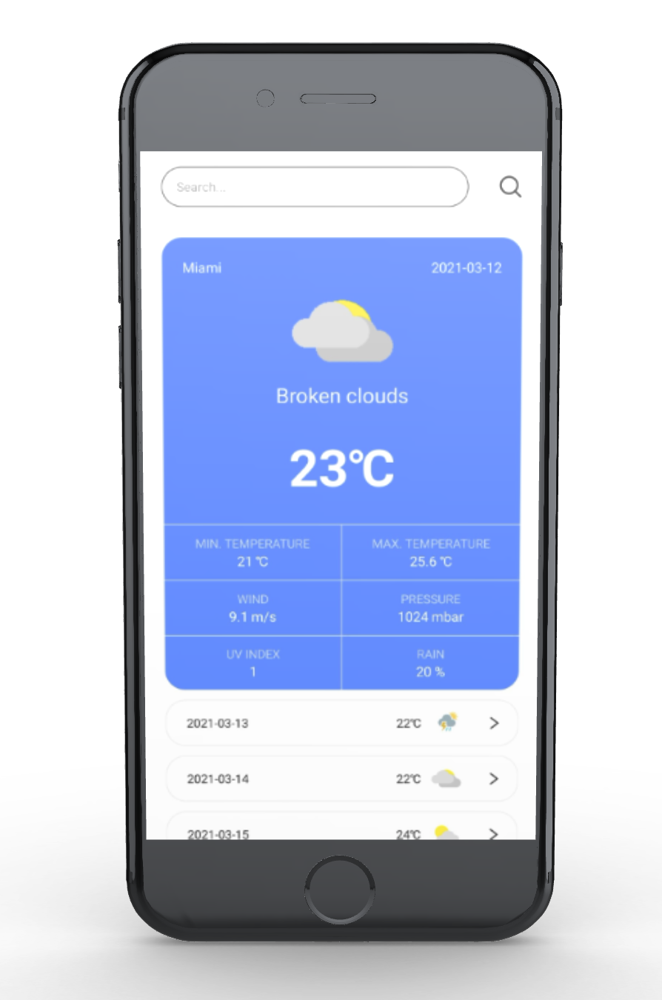
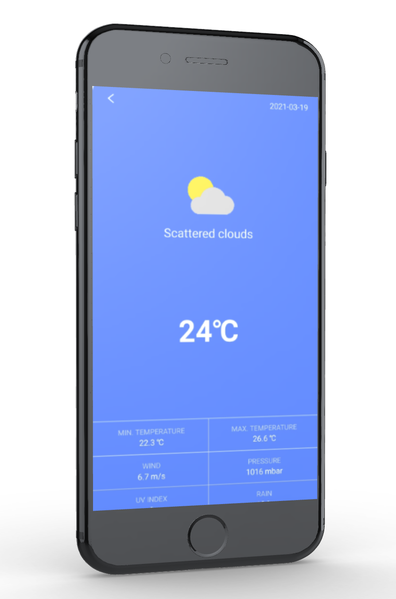

# Weather Forecast React Native

Weather forecast app provides detailed local forecast & weather forecast world wide, the app provides the current temperature in Celsius according to city time zone.

The weather app also provides atmospheric minimal and maximal temperature throughout the day, pressure, UV index rain precipitation, wind speed, in addition to 15 days in future.

I used a public API in the project [weatherbit.io](https://www.weatherbit.io/).

  
    

## Tech/framework

| Tech                                          | Description                                               |
| --------------------------------------------- | --------------------------------------------------------- |
| [React](https://reactjs.org/)                 | Library for building user interfaces                      |
| [React Native](https://reactnative.dev/)      | Creating native apps for Android and iOS using React      |
| [Typescript](https://www.typescriptlang.org/) | Javascript superset language                              |
| [Redux](https://redux.js.org/)                | Predictable state container for JavaScript apps           |
| [Expo](https://docs.expo.io/)                 | Framework and a platform for universal React applications |

## Installation

1. Clone a project: `git clone https://github.com/eszczepan/Weather-app-ReactNative`

2. Install dependencies: `npm install`

3. Install Expo CLI: `npm install --global expo-cli`

4. Run app in development mode using Expo CLI: `npm start`

5. On your Android device, press "Scan QR Code" on the "Projects" tab of the Expo Go app and scan the QR code you see in the terminal or in Expo Dev Tools.

## Available scripts

| Command           | Description                                        |
| ----------------- | -------------------------------------------------- |
| `npm run start`   | Run app in development mode                        |
| `npm run android` | Open app on a connected Android device or emulator |
| `npm run ios`     | Open app in the iOS Simulator                      |
| `npm run web`     | Open app on web                                    |
| `npm run eject`   | Eject CRA                                          |
